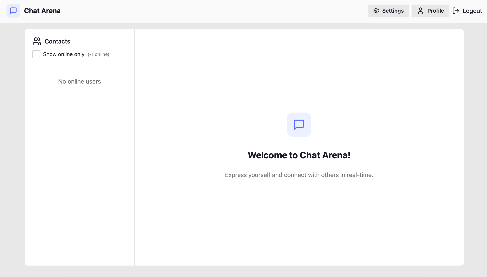

# Chat Arena




---
## About
A modern and responsive Real-Time Chat Application built using the MERN Stack (MongoDB, Express.js, React.js, Node.js), featuring seamless messaging, secure user authentication, and live updates via Socket.io. Communicate instantly with a clean UI and a fast, efficient backend architecture.

---

## 🚀 Live Demo

🔗 [View Live Portfolio]( https://chat-arena.onrender.com/ )

---

## Highlights:

- Chat arena where you interact with user at real-time.
- Authentication && Authorization with JWT
- A huge collection of theme, UI.
- Online user status

---

## Tech Stack

- Javascript
- React.js
- MongoDB
- Mongoose
- Socket.io
- JWT
- Cloundinary
- Tailwind + DasiyUI
- Postman

<!-- 
### Build the app

```shell
npm run build
```

### Start the app

```shell
npm start
``` 
For genrate the JWT secret key
cmd  -- openssl rand -base64 32

-->
